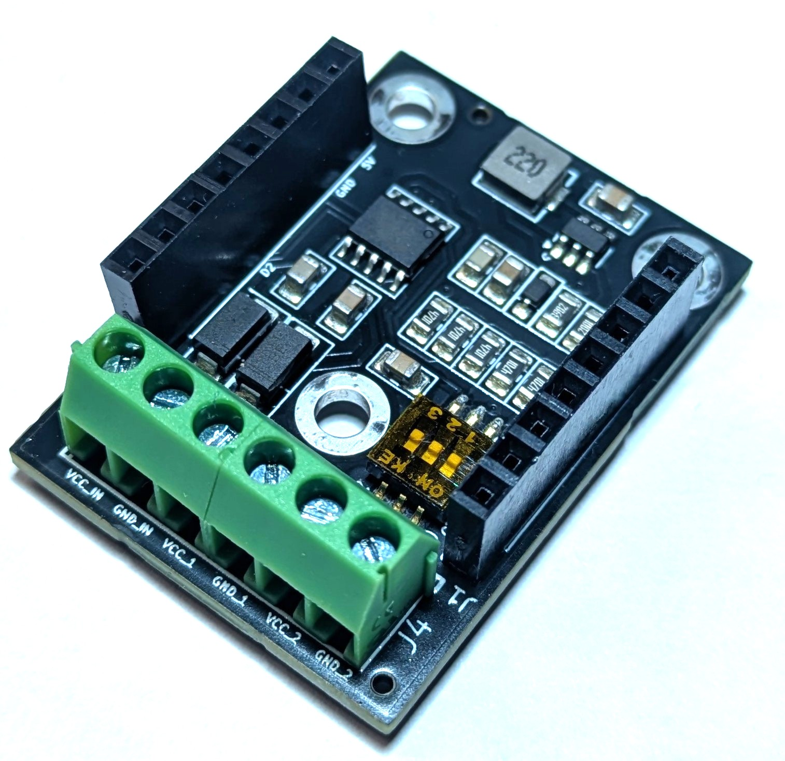
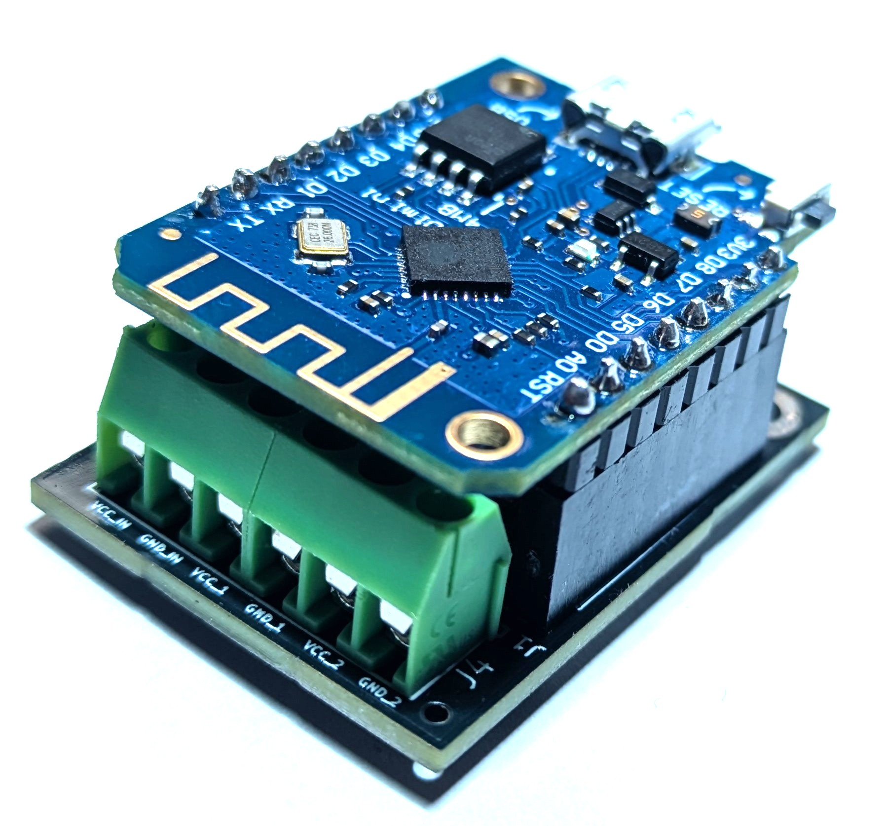
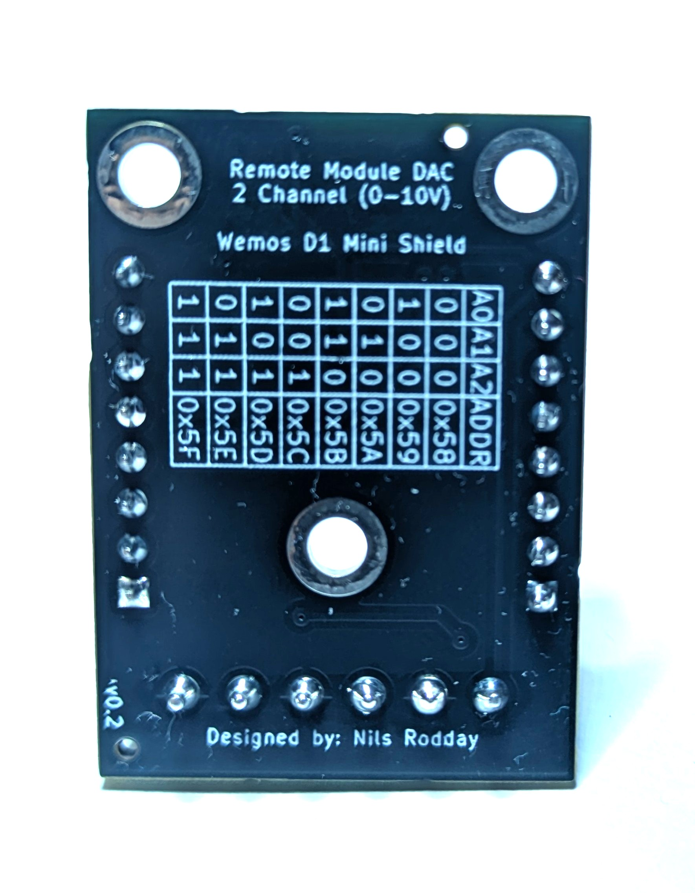
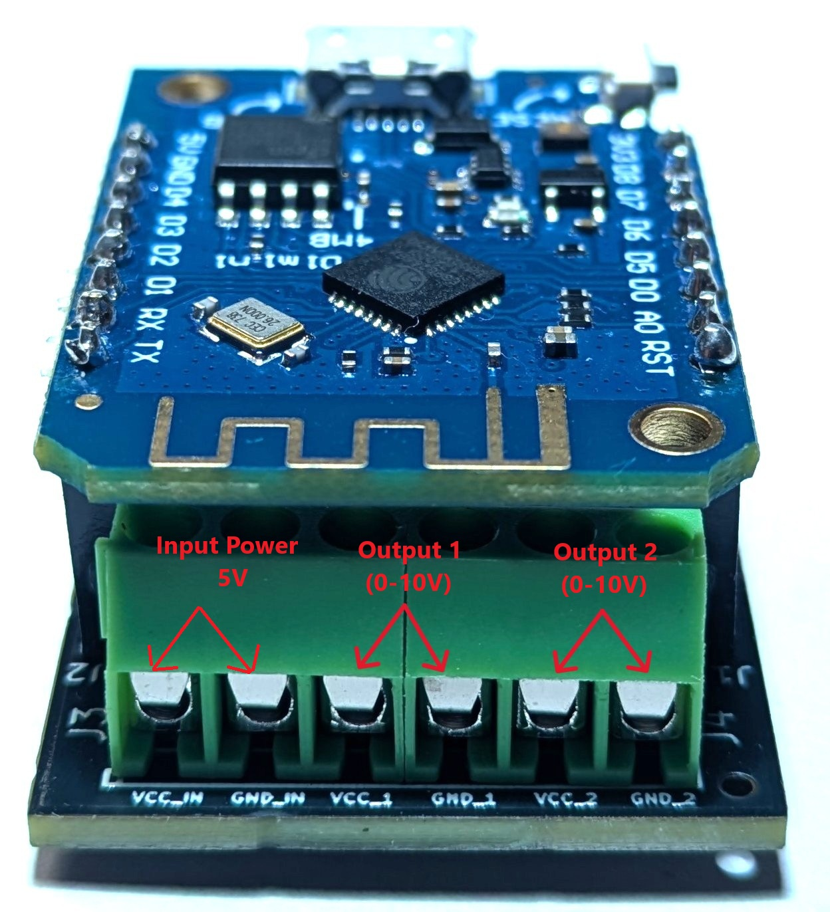

# Wemos D1 Mini Shield - I2C Digital-to-Analog Converter - 2 Channel 0-10V Output

  

This repository contains the sample YAML file to use with the "Wemos D1 Mini Shield - I2C Digital-to-Analog Converter - 2 Channel 0-10V Output" shield. 

In order to use the shield, follow the steps below:

1.1 Edit the following parameters to directly connect your Wemos D1 Mini upon boot to your Wifi network:
>WIFINAME
>
>WIFI_PASSWORD

1.2 (Optional) Edit the OTA_PASSWORD to allow Over-the-Air updates via Home Assistant, if necessary.

1.3 (Optional) Edit the AP_PASSWORD to connect to allow for remote connections to the AccessPoint of the Wemos D1 Mini in case the WiFi network from step 1.1 is not available.

1.2 (Optional) Edit the "address: 0x5f" parameter of the I2C bus and flip the DIP switch accodingly (refer to the back of the PCB), if you want to change the address. The default is 0x5f, no change is needed for the board to work.

2. Attach your Wemos D1 Mini shield via USB to your computer and run ESPHome with the adjusted YAML file to flash your Wemos D1 Mini:
>esphome run DAC2Channel_Light.yaml

3. Once flashing is done, attach your Wemos D1 Mini to the shield (pay attention to the correct orientation, 5V PIN is indicated on the shield and on the Wemos D1 Mini or have a look at the product pictures) and provide 5V and Ground to the shield OR power the shield from the Wemos D1 Mini Micro-USB port. Do not connect both power sources at the same time!

HomeAssistant will detect a new ESPHome instance with two controls: 
HA Module DAC 2Ch Light Dimmable Light 1
HA Module DAC 2Ch Light Dimmable Light 2

4. You can now control the two output sockets by entering a percentage of light brightness in HomeAssistant. E.g. if you enter 59% brightness on Dimmable Light 1, the module will provide 5.9V on the output no. 1.

